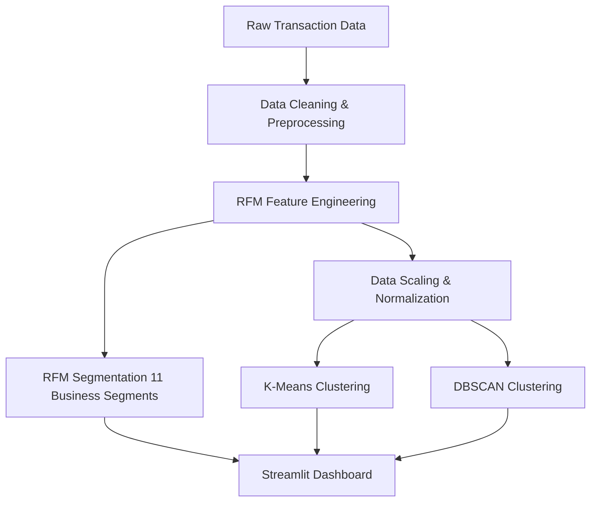
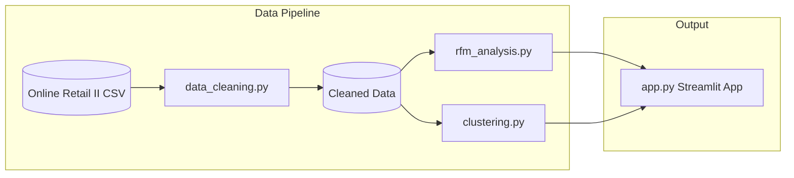

# Customer Segmentation Project


## 1. Problem Statement & Business Value

In the competitive retail landscape, understanding customer behavior is critical for maximizing revenue and retention. Generic marketing strategies often result in low engagement and wasted resources. This project implements a data-driven **Customer Segmentation** pipeline using RFM (Recency, Frequency, Monetary) analysis and unsupervised machine learning (K-Means & DBSCAN). 

By identifying distinct customer cohorts, the business can:
- **Increase ROI** through targeted marketing campaigns.
- **Improve Retention** by identifying "At Risk" and "About to Sleep" customers.
- **Maximize Lifetime Value (CLV)** by rewarding "Champions" and "Loyal Customers".

## 2. Dataset

This project utilizes the **Online Retail II dataset** from the UCI Machine Learning Repository.

- **Total Transactions:** 525,461
- **Unique Customers:** 4,312
- **Geographic Reach:** 37 countries
- **Total Revenue:** $8.83M
- **Average Order Value:** $459.69

**Data Cleaning:** 22.4% of the raw data was removed during the preprocessing phase (handling null values, filtering out cancellations and negative quantities) to ensure high-quality inputs for the models.

## 3. Methodology

Our approach combines deterministic business rules (RFM) with exploratory machine learning clustering.



### RFM Analysis
Customers were scored (1-5) on Recency, Frequency, and Monetary metrics, leading to 11 distinct business segments: *Champions, Loyal Customers, Potential Loyalists, Recent Customers, Promising, Need Attention, About to Sleep, At Risk, Can't Lose, Hibernating, Lost.*

## 4. Key Results & Metrics

We evaluated multiple clustering algorithms to find natural groupings beyond the rule-based RFM segments.

| Model | Clusters | Silhouette Score | Calinski-Harabasz | Davies-Bouldin | Notes |
|-------|----------|------------------|-------------------|----------------|-------|
| **K-Means** | 2 | 0.4221 | 4132.7 | 0.9112 | Optimal k=2 |
| **DBSCAN** | 2 | 0.5320 | - | - | eps=0.7, min_samples=5 (22 noise points) |

DBSCAN provided a higher Silhouette Score by effectively isolating 22 outlier customers (noise) who exhibited extreme purchasing behavior, allowing for cleaner primary clusters.

## 5. Project Structure

```text
Customer Segmentation/
├── config.py                 # Configuration and constants
├── data/                     # Raw and processed datasets
├── notebooks/                # Jupyter notebooks for EDA
├── src/                      # Source code package
│   ├── __init__.py
│   ├── data_cleaning.py      # Data preprocessing pipeline
│   ├── rfm_analysis.py       # RFM scoring and segmentation
│   ├── clustering.py         # K-Means and DBSCAN models
│   └── app.py                # Streamlit dashboard application
├── tests/                    # Unit tests suite
├── requirements.txt          # Python dependencies
└── README.md                 # Project documentation
```

## 6. Architecture Diagram



## 7. Quick Start

Follow these steps to run the project locally.

1. **Clone the repository:**
   ```bash
   git clone git remote add origin https://github.com/ahmadbinjaffar/Customer-Segmentation-Engine-RFM-ML.git
   cd Customer-Segmentation-Engine-RFM-ML
   ```

2. **Install dependencies:**
   ```bash
   pip install -r requirements.txt
   ```

3. **Run the data pipeline:**
   *(Ensure raw data is placed in the `data/` folder according to config.py)*
   ```bash
   python src/data_cleaning.py
   python src/rfm_analysis.py
   python src/clustering.py
   ```

4. **Launch the Streamlit Dashboard:**
   ```bash
   streamlit run src/app.py
   ```

## 8. Dashboard

The interactive Streamlit dashboard provides comprehensive insights across 5 tabs:
1. **Overview:** High-level KPIs (Revenue, AOV, Customer Count).
2. **RFM Analysis:** Distribution of the 11 business segments.
3. **Clustering:** 3D scatter plots and cluster profiles.
4. **Customer Lookup:** Deep-dive into individual customer metrics.
5. **Segment Profiles:** Actionable recommendations for marketing.


## 9. Testing

The codebase is thoroughly tested to ensure reliability.

- **Current Status:** 16/16 Unit Tests Passing

Run the test suite using pytest:
```bash
pytest tests/ -v
```

## 10. Future Work

- **Predictive Customer Lifetime Value (CLV):** Implement regression models to predict future spending based on historical RFM patterns.
- **Real-Time Scoring Pipeline:** Transition from batch processing to real-time event streaming for immediate segment updates.
- **A/B Testing Integration:** Connect segments directly to an A/B testing platform to measure the impact of segment-specific campaigns.

## 11. Author & Contributing

**Author:** Ahmed Bin Jaffar ahmedbinjaffarpk@gmail.com

Contributions are welcome Please feel free to submit a Pull Request or open an Issue to discuss improvements.
